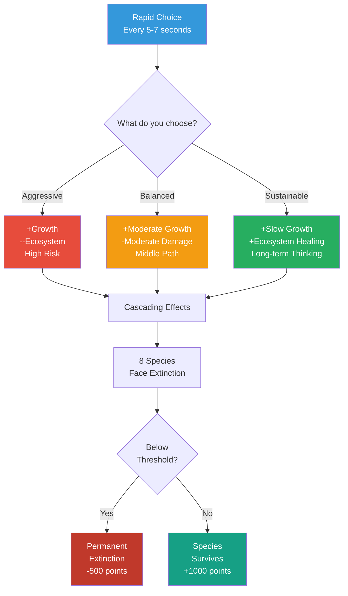
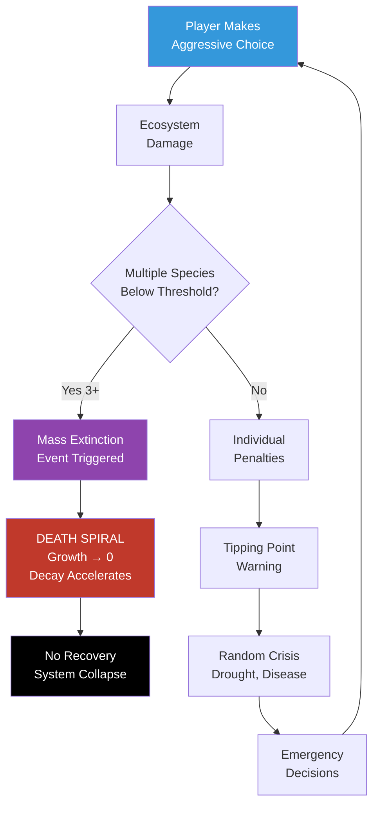

# BIOMES EVOLUTION - Presentation Slides

## Slide 1: Title
**BIOMES EVOLUTION**  
*Balancing Civilization Growth with Ecosystem Health*

Franklyn Okechukwu (2025)  
Play: [chimerical-raindrop-52f1e7.netlify.app/biomes.html](https://chimerical-raindrop-52f1e7.netlify.app/biomes.html)

---

## Slide 2: Central Question

> **How do we balance the future and growth of our civilization with the health of our ecosystem?**

Through game mechanics that force players to confront **trade-offs** between human expansion and species survival.

---

## Slide 3: Game Flow - Evolution to Anthropocene

---

## Slide 4: Core Decision Loop

---

## Slide 5: Key Design Variables

### 1. **Choice Type** (Player Agency)
- Aggressive vs. Sustainable vs. Balanced
- Each has trade-offs

### 2. **Species Thresholds** (Ecosystem Agency)
- 8 iconic species with extinction limits
- Pollinators, apex predators, forests, coral reefs...

### 3. **Tipping Points** (Systemic Feedback)
- Ecosystem < 30%: Cascading failures
- < 15%: Death spiral (no recovery)

### 4. **Time Pressure** (Climate Urgency)
- 3-minute countdown
- Fast decisions = bonuses
- Slow decisions = penalties

### 5. **Genetic Algorithm** (Emergent Scoring)
- Your choices create your "genes"
- Aggression, Sustainability, Adaptability, Resilience

---

## Slide 6: Ecosystem Feedback Loop

---

## Slide 7: Building Cross-Species Relationships

**Design Choice:** Name specific species, not just "biodiversity points"

**Impact:**
- Pollinators going extinct → immediate emotional response
- Players develop care through witnessing consequences
- But: Does making species "useful" reinforce anthropocentrism?

**Tension:**  
Care entangled with self-interest (we protect what benefits us)

**Learning:**  
The game doesn't resolve this—it sits with the complexity

---

## Slide 8: Deconstructing Power Hierarchies

**The Contradiction:**
- Players have god-like control (pause, manage, strategize)
- But ecosystems **fight back** (tipping points, death spirals)

**Ecosystems Have Agency:**
- They respond with their own logic
- Indifferent to human intent
- Can trigger irreversible collapse

**Genetic Algorithm:**
- Humans aren't separate from nature
- Our choices shape our evolutionary path
- We are participants, not just managers

**Critical Question:**  
Can a game truly deconstruct hierarchies when the player is still "managing" nature?

---

## Slide 9: Technology, Stewardship & Care

**Technology as Tool:**
- Makes invisible relationships visible
- Global leaderboard shares multispecies data
- Backend tracks species survival across all players

**Technology as Trap:**
- Leaderboard promotes competition, not stewardship
- "Beat the high score" → domination logic
- Does gamification help or hurt ecological thinking?

**Coding Humility:**
- Random crisis events → uncertainty
- Extinction permanence → no "undo"
- Death spiral → unrecoverable failure

**Hardest Code I Wrote:**  
Making extinction permanent. Once a species is gone, it's gone.

---

## Slide 10: What I Learned

### Surprising Player Behaviors:
- Some always choose "sustainable" first (rituals)
- Others deliberately trigger mass extinction (experimentation)
- No single "optimal" strategy emerges

### Design Contradictions:
- 3-minute timer = climate urgency
- But real ecological change takes centuries
- The compression distorts scale

### If I Redesigned:
- Add "slow mode" without timer
- Let players sit with consequences
- Remove competitive leaderboard?

**Most Important Insight:**  
The game reveals values through choice patterns. It doesn't prescribe answers—it creates space for questions.

---

## Slide 11: Final Reflection

> *"Biomes Evolution is both a tool for ecological thinking and a product of anthropocentric game design."*

**What it does well:**
- Makes invisible relationships visible
- Creates empathy for specific species
- Shows cascading consequences in real-time

**What it struggles with:**
- Still centers human agency
- Competitive framing may undermine care
- Time compression distorts ecological reality

**The Question:**  
Can we care for species while benefiting from their existence?  
Can technology foster stewardship or does it inevitably reinforce domination?

*I don't have answers. But the game creates space to sit with these questions.*

---

## Slide 12: Play & Discuss

**Live Game:**  
[chimerical-raindrop-52f1e7.netlify.app/biomes.html](https://chimerical-raindrop-52f1e7.netlify.app/biomes.html)

**GitHub:**  
[github.com/chezona/Biomes](https://github.com/chezona/Biomes)

**After Playing, Reflect:**
- What species did you lose first? Why?
- Did you prioritize growth or sustainability?
- How did time pressure affect your choices?
- Would you play differently a second time?

*Design is not neutral. Every choice encodes values.*  
*What values does this game encode?*

---

## Appendix: Technical Implementation

**Systems:**
- Session Timer (3 min)
- Choice Engine (randomized every 5-7s)
- Species Tracker (8 species, dynamic thresholds)
- Genetic Algorithm (emergent scoring)
- Crisis System (random events)
- Global Leaderboard (Railway backend)

**Tech Stack:**
- Frontend: Vanilla JavaScript (ES6)
- Backend: Node.js + Express
- Deploy: Netlify + Railway

**Design Principles:**
1. Visibility (make relationships explicit)
2. Consequence (permanent extinction)
3. Tension (growth vs. sustainability)
4. Emergence (unpredictable outcomes)
5. Reflection (end-game narrative)

---

**END**

*Franklyn Okechukwu, 2025*  
*Making the invisible consequences of anthropocentric decision-making visible through game design.*

