# BIOMES EVOLUTION
**A Game About Trade-offs Between Civilization and Ecosystem Health**

**Play Now:** [https://chimerical-raindrop-52f1e7.netlify.app/biomes.html](https://chimerical-raindrop-52f1e7.netlify.app/biomes.html)

---

## Game Flow & Key Decision Variables

```mermaid
graph TD
    Start[Game Start] --> Intro[Introduction Phase]
    
    Intro --> RNA[Collect RNA<br/>Click to gather<br/>genetic material]
    RNA --> DNA[Synthesize DNA<br/>Transform RNA → DNA<br/>threshold: 30 DNA]
    
    DNA --> Timeline[Evolution Timeline<br/>Primordial Ooze → Modern Era]
    Timeline --> Biome[Choose Your Biome<br/>8 unique ecosystems]
    
    Biome --> Game[Core Gameplay Loop<br/>3-minute countdown]
    
    Game --> Growth[Automatic Resource Growth<br/>Population ↑<br/>Technology ↑<br/>Ecosystem Health ↓]
    
    Game --> Decay[Natural Decay<br/>All stats decay 30%/min<br/>Simulates entropy]
    
    Game --> Choice[Rapid Choices<br/>Every 5-7 seconds]
    
    Choice --> Type{Choice Type}
    Type -->|Aggressive| Agg[High Growth<br/>Severe Ecosystem Damage<br/>+Population +Tech<br/>--Ecosystem]
    Type -->|Balanced| Bal[Moderate Growth<br/>Moderate Damage<br/>+Population +Tech<br/>-Ecosystem]
    Type -->|Sustainable| Sus[Slow Growth<br/>Ecosystem Recovery<br/>+Population -Tech<br/>+Ecosystem]
    
    Agg --> Consequences
    Bal --> Consequences
    Sus --> Consequences
    
    Consequences[Cascade Effects] --> Species[Species Tracker<br/>8 iconic species]
    Species --> Threshold{Below Extinction<br/>Threshold?}
    
    Threshold -->|Yes| Extinct[Species Goes Extinct<br/>Permanent Loss<br/>Penalties Applied]
    Threshold -->|No| Survive[Species Survives]
    
    Extinct --> Count{Multiple<br/>Extinctions?}
    Count -->|3+ species| Mass[Mass Extinction Event<br/>Death Spiral Active<br/>Growth → 0<br/>Decay Accelerates]
    Count -->|< 3 species| Penalties[Individual Penalties<br/>Lost ecosystem services]
    
    Survive --> Tipping{Ecosystem < 30%}
    Tipping -->|Yes| Warning[Tipping Point Warning<br/>Cascading failures imminent]
    Tipping -->|No| Stable[System Stable]
    
    Warning --> Crisis[Random Crisis Events<br/>Drought, Disease, Climate Shift]
    Crisis --> Emergency[Emergency Choices<br/>High stakes decisions]
    
    Penalties --> Momentum
    Mass --> Momentum
    Stable --> Momentum
    Emergency --> Momentum
    
    Momentum[Momentum System] --> Speed{Answer within<br/>5 seconds?}
    Speed -->|Yes| Fast[Speed Bonus<br/>Multiplier increases]
    Speed -->|No| Slow[Momentum Lost<br/>Multiplier resets]
    
    Fast --> Streak{Same choice<br/>type 3x?}
    Streak -->|Yes| StreakBonus[Streak Bonus<br/>Specialization path]
    Streak -->|No| Normal[Normal scoring]
    
    StreakBonus --> Genetic
    Normal --> Genetic
    Slow --> Genetic
    
    Genetic[Genetic Algorithm] --> Traits[Calculate Gene Profile<br/>Aggression<br/>Sustainability<br/>Adaptability<br/>Resilience]
    
    Traits --> Final[Final Score Calculation]
    Final --> Survival[Species Survival Bonus<br/>+1000 per species alive]
    Final --> Extinction[Extinction Penalty<br/>-500 per species lost]
    Final --> Balance[Ecosystem Balance<br/>Reward healthy systems]
    
    Survival --> End[Game End<br/>3 minutes elapsed]
    Extinction --> End
    Balance --> End
    
    End --> Narrative[Species Narrative<br/>Which species survived?<br/>What's the story?]
    Narrative --> Leaderboard[Global Leaderboard<br/>How did you rank?]
    
    Leaderboard --> Reflection[Player Reflection<br/>What were the trade-offs?<br/>What would you change?]

    style Start fill:#2c3e50,stroke:#ecf0f1,color:#ecf0f1
    style Intro fill:#34495e,stroke:#ecf0f1,color:#ecf0f1
    style Biome fill:#16a085,stroke:#ecf0f1,color:#ecf0f1
    style Choice fill:#3498db,stroke:#ecf0f1,color:#ecf0f1
    style Agg fill:#e74c3c,stroke:#ecf0f1,color:#ecf0f1
    style Sus fill:#27ae60,stroke:#ecf0f1,color:#ecf0f1
    style Extinct fill:#c0392b,stroke:#ecf0f1,color:#ecf0f1
    style Mass fill:#8e44ad,stroke:#ecf0f1,color:#ecf0f1
    style Genetic fill:#f39c12,stroke:#ecf0f1,color:#ecf0f1
    style End fill:#2c3e50,stroke:#ecf0f1,color:#ecf0f1
    style Reflection fill:#34495e,stroke:#ecf0f1,color:#ecf0f1
```

---

## Key Decision Variables

### 1. **Choice Type** (Player Agency)
- **Aggressive**: Prioritize growth, damage ecosystem
- **Balanced**: Moderate trade-offs
- **Sustainable**: Heal ecosystem, slower growth

### 2. **Species Thresholds** (Ecosystem Agency)
- Each species has extinction threshold tied to ecosystem health
- Pollinators, apex predators, old growth forests, coral reefs, etc.
- **Permanent consequences** when thresholds crossed

### 3. **Tipping Points** (Systemic Feedback)
- Ecosystem < 30%: Cascading failures begin
- < 15%: Death spiral activates (growth stops, decay accelerates)

### 4. **Momentum & Speed** (Temporal Pressure)
- Fast decisions = bonuses (mimics climate urgency)
- Streaks = specialization paths
- Penalties for slow responses

### 5. **Genetic Algorithm** (Emergent Scoring)
- Calculates player "genes" based on choices:
  - Aggression score
  - Sustainability score  
  - Adaptability score
  - Resilience score
- Final score reflects **relationship with ecosystem**, not just growth

---

## Reflection Essay: Design as Multispecies Thinking

**Franklyn Okechukwu (2025)**

### How do we balance the future and growth of our civilization with the health of our ecosystem?

Through game mechanics that force players to confront trade-offs between human expansion and species survival, *Biomes Evolution* demonstrates how design can make visible the often-invisible consequences of anthropocentric decision-making.

#### Building Cross-Species Relationships

When I first coded the species tracker, I treated each species—pollinators, apex predators, old growth forests, coral reefs, migratory birds, keystone species, deep sea life, and megafauna—as variables with numeric thresholds. It felt extractive, reducing living beings to data points. But something shifted when I watched playtesters ignore pollinators until they went extinct, then panic when they realized the ecosystem collapse that followed. The game creates empathy not through abstract "ecosystem health" numbers, but through specific, named species with visible fates.

I struggled with whether making species "useful" (applying penalties when they go extinct) reinforces anthropocentrism or creates care. The extinction penalty system (−500 points per species, cascading ecosystem failures) does frame species in terms of human utility. Yet this mirrors our reality: we often only recognize the value of pollinators when crops fail, or apex predators when prey populations explode. The game doesn't resolve this tension—it sits with it. Players must confront that their "care" for species is entangled with self-interest, which feels more honest than pretending we can separate the two.

#### Deconstructing Power Hierarchies

The most revealing design choice was the tipping point mechanic. When ecosystem health drops below 30%, the game doesn't just penalize the player—the ecosystem fights back. Growth stops. Decay accelerates. Species extinctions cascade. This mechanic emerged from my realization that ecosystems have agency; they respond to our actions with their own logic, indifferent to human intent.

Yet there's an unavoidable contradiction: the player still has ultimate control. They can pause, strategize, and "manage" nature like a god-game. I initially designed it this way for gameplay clarity, but it reinforces the very hierarchy I wanted to critique. The player is separate from nature, acting upon it rather than within it. The genetic algorithm scoring partially addresses this—by calculating player "genes" that evolve based on choices, it suggests humans aren't separate from nature, but participants in evolutionary processes. Still, the player-as-manager framing reveals how deeply embedded anthropocentrism is in game design conventions. Deconstructing power hierarchies is harder than I thought.

#### Technology, Stewardship & Care

Building the backend leaderboard system forced me to confront technology's role in ecological thinking. The competitive leaderboard promotes ego and domination—"beat the high score"—which feels antithetical to stewardship. But it also makes multispecies data visible and shareable across a global community. Technology is both tool and trap.

The random crisis events (drought, disease, climate shifts) were my attempt to code humility into the system. No matter how well you play, uncertainty remains. You can't predict or control everything. This mirrors real climate science: we have models, but nature exceeds our simulations. When I coded the "death spiral" mechanic, I realized I was designing a fail state with no recovery—permanent, like real extinction. It felt cruel, but making it reversible would be dishonest. The most difficult code I wrote was the extinction permanence. Once a species is gone, it's gone. That finality taught me more about care than any success state.

#### What I Learned

I set the game to 3 minutes because I wanted time pressure to mirror climate urgency. But this also creates a paradox: real ecological change happens over centuries, yet we demand immediate action. The game compresses time, which makes trade-offs visceral but also distorts their true scale. If I were to redesign it, I might add a "slow mode" that removes the timer, letting players sit with consequences rather than rushing past them.

What surprised me most was how players develop rituals. Some always choose "sustainable" first. Others deliberately trigger mass extinction to see what happens. The game doesn't prescribe right answers—it reveals values through choice patterns. The genetic algorithm scoring reflects this: there's no single "optimal" strategy, only different relationships with the ecosystem, each with distinct consequences.

*Biomes Evolution* is both a tool for ecological thinking and a product of anthropocentric game design. It makes invisible relationships visible, but through a frame that still centers human agency. The game asks: can we care for species while benefiting from their existence? Can technology foster stewardship or does it inevitably reinforce domination? I don't have answers, but the game creates space to sit with these questions. And maybe that's enough.

---

## Technical Details

### Core Systems
- **Session Timer**: 3-minute countdown
- **Choice Engine**: Randomized options every 5-7 seconds
- **Species Tracker**: 8 species with dynamic extinction thresholds
- **Genetic Algorithm**: Emergent scoring based on choice patterns
- **Crisis System**: Random events with cascading consequences
- **Momentum Multiplier**: Rewards fast, consistent decision-making
- **Global Leaderboard**: Railway backend with in-memory storage

### Technology Stack
- **Frontend**: Vanilla JavaScript (ES6 modules)
- **Backend**: Node.js + Express
- **Deployment**: Netlify (frontend) + Railway (backend)
- **Storage**: In-memory (top 1000 scores)

### Design Principles
1. **Visibility**: Make ecological relationships explicit
2. **Consequence**: Permanent extinction, no "undo"
3. **Tension**: Growth vs. sustainability always in conflict
4. **Emergence**: Genetic algorithm creates unpredictable outcomes
5. **Reflection**: End-game narrative prompts player introspection

---

## Play & Reflect

The game is live at: **[https://chimerical-raindrop-52f1e7.netlify.app/biomes.html](https://chimerical-raindrop-52f1e7.netlify.app/biomes.html)**

After playing, consider:
- What species did you lose first? Why?
- Did you prioritize growth or sustainability? What does that reveal?
- How did time pressure affect your choices?
- Would you play differently a second time?

*Design is not neutral. Every choice encodes values. What values does this game encode? What would you change?*

---

## License
MIT License - Feel free to fork, modify, and extend.

## Acknowledgments
Built with data insights from PNVmaps (global biome classification) and designed to provoke questions about human-nonhuman relationships in the Anthropocene.

---

**Franklyn Okechukwu, 2025**  
*Biomes Evolution: Making the invisible consequences of anthropocentric decision-making visible through game design.*
